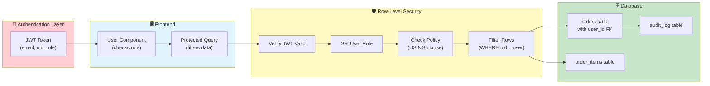
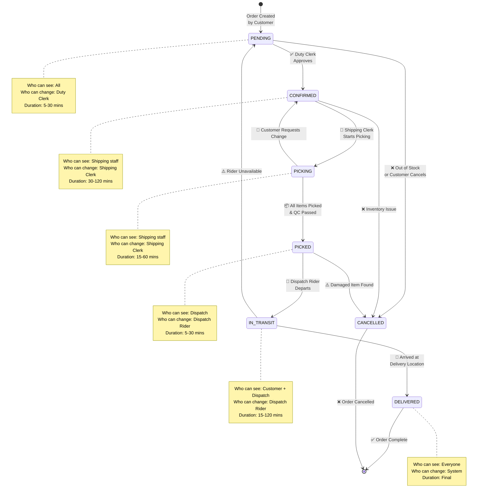
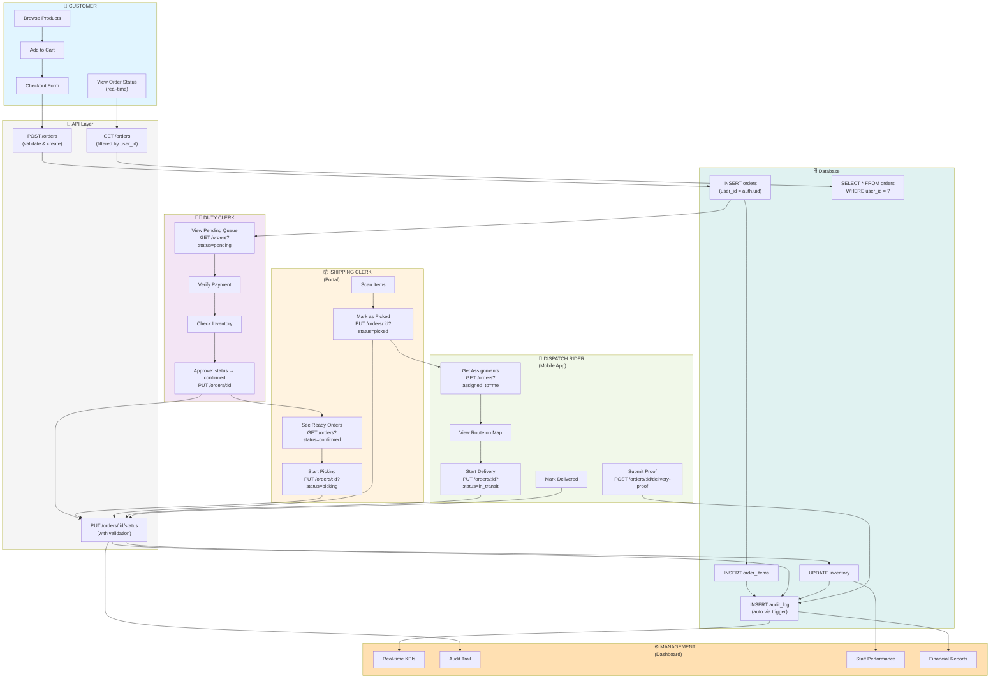
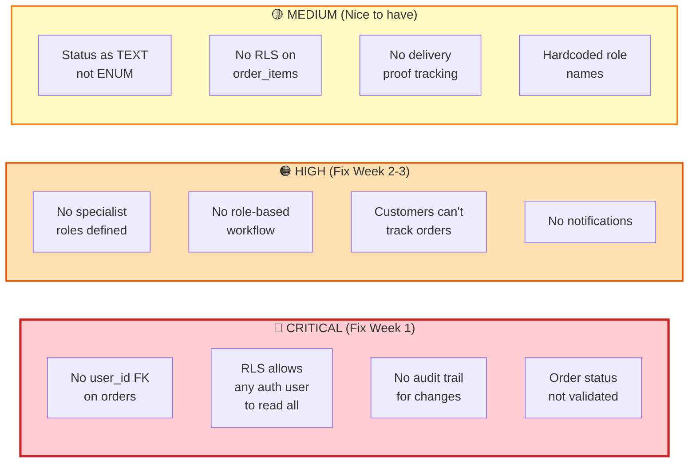
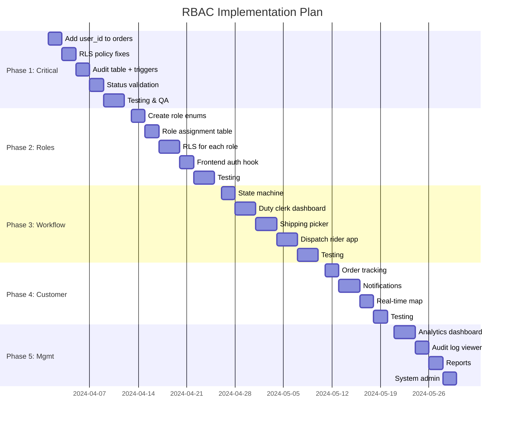

# Smart Cart AI - RBAC Visual Diagrams & Matrices

## Access Control Matrices & Flow Diagrams

---

## 1. Role Permission Matrix

```txt
┌──────────────────────────────────────────────────────────────────────────┐
│                      PERMISSION MATRIX BY ROLE                          │
├──────────────────────────────┬──────┬───────┬─────────┬────────┬────────┤
│ Permission                   │Cust. │Duty   │Shipping │Dispatch│Mgmt.  │
│                              │      │Clerk  │Clerk    │Rider   │       │
├──────────────────────────────┼──────┼───────┼─────────┼────────┼────────┤
│ View own orders              │ ✅   │  -    │   -     │   -    │  ✅    │
│ View all orders              │ ❌   │  ✅   │   ✅    │  ❌    │  ✅    │
│ View pending orders          │ ❌   │  ✅   │   ❌    │  ❌    │  ✅    │
│ View confirmed orders        │ ❌   │  ❌   │   ✅    │  ❌    │  ✅    │
│ View picking queue           │ ❌   │  ❌   │   ✅    │  ❌    │  ✅    │
│ View picked orders           │ ❌   │  ❌   │   ❌    │  ✅    │  ✅    │
│ View in-transit orders       │ ❌   │  ❌   │   ❌    │  ✅    │  ✅    │
│ View delivered orders        │ ✅   │  ❌   │   ❌    │  ❌    │  ✅    │
│ Mark order as confirmed      │ ❌   │  ✅   │   ❌    │  ❌    │  ✅    │
│ Mark order as picking        │ ❌   │  ❌   │   ✅    │  ❌    │  ✅    │
│ Mark order as picked         │ ❌   │  ❌   │   ✅    │  ❌    │  ✅    │
│ Mark order as in_transit     │ ❌   │  ❌   │   ❌    │  ✅    │  ✅    │
│ Mark order as delivered      │ ❌   │  ❌   │   ❌    │  ✅    │  ✅    │
│ Cancel orders                │ ❌   │  ⚠️   │   ❌    │  ❌    │  ✅    │
│ Assign orders to staff       │ ❌   │  ❌   │   ❌    │  ❌    │  ✅    │
│ Track delivery GPS           │ ❌   │  ❌   │   ❌    │  ✅    │  ✅    │
│ Submit delivery proof        │ ❌   │  ❌   │   ❌    │  ✅    │  ✅    │
│ View inventory               │ ❌   │  ✅   │   ✅    │  ❌    │  ✅    │
│ Update inventory             │ ❌   │  ❌   │   ⚠️    │  ❌    │  ✅    │
│ View cost prices             │ ❌   │  ✅   │   ✅    │  ❌    │  ✅    │
│ View profit margins          │ ❌   │  ❌   │   ❌    │  ❌    │  ✅    │
│ View analytics               │ ❌   │  ❌   │   ❌    │  ❌    │  ✅    │
│ Manage users & roles         │ ❌   │  ❌   │   ❌    │  ❌    │  ✅    │
│ View audit logs              │ ❌   │  ❌   │   ❌    │  ❌    │  ✅    │
│ Generate reports             │ ❌   │  ❌   │   ❌    │  ❌    │  ✅    │
└──────────────────────────────┴──────┴───────┴─────────┴────────┴────────┘

Legend:
✅ = Can perform
❌ = Cannot perform  
⚠️ = Limited/Conditional (e.g., only own orders)
-  = Not applicable
```

---

## 2. Data Field Visibility Matrix

```txt
┌──────────────────────────────────────────────────────────────────────────┐
│              DATA FIELD VISIBILITY BY ROLE & CONTEXT                    │
├─────────────────────────────┬──────┬───────┬─────────┬────────┬────────┤
│ Data Field                  │Cust. │Duty   │Shipping │Dispatch│Mgmt.  │
│                             │      │Clerk  │Clerk    │Rider   │       │
├─────────────────────────────┼──────┼───────┼─────────┼────────┼────────┤
│ ORDER FIELDS                │      │       │         │        │        │
│ ├─ Order ID                 │ ✅   │  ✅   │   ✅    │  ✅    │  ✅    │
│ ├─ Customer Name            │ ✅   │  ✅   │   ✅    │  ✅    │  ✅    │
│ ├─ Customer Email           │ ✅   │  ✅   │   🔒    │  ✅    │  ✅    │
│ ├─ Customer Phone           │ ✅   │  ✅   │   🔒    │  ✅*   │  ✅    │
│ ├─ Delivery Address         │ ✅   │  ✅   │   ✅    │  ✅    │  ✅    │
│ ├─ City/Zip                 │ ✅   │  ✅   │   🔒    │  ✅    │  ✅    │
│ ├─ Created At               │ ✅   │  ✅   │   ✅    │  ✅    │  ✅    │
│ ├─ Status                   │ ✅   │  ✅   │   ✅    │  ✅    │  ✅    │
│                             │      │       │         │        │        │
│ ORDER ITEMS                 │      │       │         │        │        │
│ ├─ Product Name             │ ✅   │  ✅   │   ✅    │  ✅ *  │  ✅    │
│ ├─ Quantity                 │ ✅   │  ✅   │   ✅    │  ✅    │  ✅    │
│ ├─ Unit Price               │ ✅   │  ✅   │   ✅    │  🔒    │  ✅    │
│ ├─ Total Price (per item)   │ ✅   │  ✅   │   ✅    │  🔒    │  ✅    │
│                             │      │       │         │        │        │
│ PRICING FIELDS              │      │       │         │        │        │
│ ├─ Subtotal                 │ ✅   │  ✅   │   🔒    │  🔒    │  ✅    │
│ ├─ Delivery Fee             │ ✅   │  ✅   │   🔒    │  🔒    │  ✅    │
│ ├─ Tax                      │ ✅   │  ✅   │   🔒    │  🔒    │  ✅    │
│ ├─ Total Amount             │ ✅   │  ✅   │   🔒    │  🔒    │  ✅    │
│ ├─ Cost Price               │ ❌   │  ✅   │   ✅    │  ❌    │  ✅    │
│ ├─ Profit/Margin            │ ❌   │  ❌   │   ❌    │  ❌    │  ✅    │
│                             │      │       │         │        │        │
│ STAFF FIELDS                │      │       │         │        │        │
│ ├─ Duty Clerk Name          │ ❌   │  ✅   │   ⚠️ *  │  ❌    │  ✅    │
│ ├─ Shipping Clerk Name      │ ❌   │  ❌   │   ✅    │  ❌    │  ✅    │
│ ├─ Dispatch Rider Name      │ ⚠️ * │  ❌   │   🔒    │  ✅    │  ✅    │
│ ├─ Dispatch Rider Phone     │ ⚠️ * │  ❌   │   🔒    │  ❌    │  ✅    │
│ ├─ Vehicle Info             │ ❌   │  ❌   │   🔒    │  ✅    │  ✅    │
│                             │      │       │         │        │        │
│ AUDIT FIELDS                │      │       │         │        │        │
│ ├─ Created By               │ ❌   │  ❌   │   ❌    │  ❌    │  ✅    │
│ ├─ Updated By               │ ❌   │  ❌   │   ❌    │  ❌    │  ✅    │
│ ├─ Audit Log                │ ❌   │  ❌   │   ❌    │  ❌    │  ✅    │
│ ├─ Status Change History    │ ⚠️   │  ⚠️   │   ⚠️    │  ⚠️    │  ✅    │
└─────────────────────────────┴──────┴───────┴─────────┴────────┴────────┘

Legend:
✅ = Can view
❌ = Cannot view
🔒 = Redacted/Hidden
⚠️ = Conditional visibility
*  = Only when order is in specific status (e.g., rider name only in_transit)
```

---

## 3. Complete Order Processing Sequence

```mermaid
graph TD
    A["👤 CUSTOMER<br/>Browses & Shops"] --> B["🛒 Adds to Cart"]
    B --> C["💳 Proceeds to Checkout"]
    C --> D["📋 Enters Delivery Info"]
    D --> E["✅ Confirms Order"]
    E --> F["📦 ORDER CREATED<br/>Status: PENDING"]
    
    F --> G["📧 Email: Order Confirmed"]
    F --> H["🔔 Notification: Duty Clerk"]
    
    H --> I["👨‍💼 DUTY CLERK<br/>Views Pending Queue"]
    I --> J["🔍 Verifies Payment"]
    J --> K["📊 Checks Inventory"]
    K --> L{All Items<br/>In Stock?}
    
    L -->|Yes| M["✅ Approves Order"]
    L -->|No| N["❌ Cancels Order"]
    N --> O["📧 Email: Refund Issued"]
    
    M --> P["Status: CONFIRMED"]
    P --> Q["📧 Alert: Shipping Clerk<br/>Order Ready to Pick"]
    
    Q --> R["📦 SHIPPING CLERK<br/>Sees Picking List"]
    R --> S["🏪 Walks to Shelves"]
    S --> T["📍 Scans Shelf Locations"]
    T --> U["✋ Picks Products"]
    U --> V["🔍 Quality Check"]
    V --> W{Everything<br/>OK?}
    
    W -->|Issues Found| X["⚠️ Reports Problem"]
    X --> Y["👨‍💼 Duty Clerk Resolves"]
    
    W -->|OK| Z["Status: PICKING"]
    Z --> AA["Status: PICKED"]
    AA --> AB["📦 Deducts Inventory"]
    AB --> AC["🔔 Alert: Dispatch Rider<br/>Order Ready"]
    
    AC --> AD["🚗 DISPATCH RIDER<br/>Views Assigned Orders"]
    AD --> AE["📍 Plans Delivery Route"]
    AE --> AF["🚚 Loads Vehicle"]
    AF --> AG["Status: IN_TRANSIT"]
    AG --> AH["📍 GPS Tracking Shared"]
    AH --> AI["📱 SMS: ETA to Customer"]
    
    AI --> AJ["👤 CUSTOMER<br/>Tracks on Map"]
    
    AJ --> AK["🏠 Arrives at Address"]
    AK --> AL["📸 Takes Photo Proof"]
    AL --> AM["✍️ Customer Confirms"]
    AM --> AN["Status: DELIVERED"]
    AN --> AO["📦 Order Complete"]
    
    AO --> AP["📧 Email: Delivery Confirmed"]
    AP --> AQ["⭐ Invite: Rate Delivery"]
    
    AQ --> AR["👤 CUSTOMER<br/>Leaves Rating"]
    AR --> AS["✅ 5 Stars!"]
    
    AS --> AT["⚙️ MANAGEMENT<br/>Sees Daily Metrics"]
    AT --> AU["📊 Analytics Updated"]
    AU --> AV["💰 Revenue Recorded"]
    AV --> AW["👷 Staff Performance Tracked"]
    
    style A fill:#e1f5ff
    style F fill:#fff3e0
    style I fill:#f3e5f5
    style P fill:#fff3e0
    style R fill:#fff3e0
    style AA fill:#fff3e0
    style Z fill:#fff3e0
    style AD fill:#f1f8e9
    style AG fill:#f1f8e9
    style AN fill:#f1f8e9
    style AT fill:#ffe0b2
```



---

## 4. Database Access Control Layer



---

## 5. Role State Machine Diagram



---

## 6. API Endpoint Access Control

```txt
┌────────────────────────────────────────────────────────────────────────┐
│                     API ENDPOINT RBAC MATRIX                          │
├──────────────────────────────────┬────────┬─────────┬──────────┬──────┤
│ Endpoint                         │GET     │POST     │PUT       │DEL   │
├──────────────────────────────────┼────────┼─────────┼──────────┼──────┤
│ /api/orders                      │        │         │          │      │
│ ├─ (all orders)                  │ MGMT   │ CUST *  │ DC/SC/DR │ MGMT │
│ └─ (own orders - customer)       │ CUST   │ -       │ -        │ CUST │
│                                  │        │         │          │      │
│ /api/orders/:id                  │        │         │          │      │
│ ├─ READ                          │ AUTH   │ -       │ -        │ -    │
│ ├─ UPDATE status → confirmed     │ -      │ -       │ DC       │ -    │
│ ├─ UPDATE status → picking       │ -      │ -       │ SC       │ -    │
│ ├─ UPDATE status → picked        │ -      │ -       │ SC       │ -    │
│ ├─ UPDATE status → in_transit    │ -      │ -       │ DR       │ -    │
│ ├─ UPDATE status → delivered     │ -      │ -       │ DR       │ -    │
│ └─ DELETE (cancel)               │ -      │ -       │ MGMT     │ -    │
│                                  │        │         │          │      │
│ /api/orders/:id/items            │        │         │          │      │
│ ├─ LIST                          │ STAFF  │ -       │ -        │ -    │
│ └─ UPDATE picked status          │ -      │ -       │ SC       │ -    │
│                                  │        │         │          │      │
│ /api/orders/:id/assignment       │        │         │          │      │
│ ├─ CREATE (assign rider)         │ -      │ MGMT    │ -        │ -    │
│ └─ READ                          │ STAFF  │ -       │ -        │ -    │
│                                  │        │         │          │      │
│ /api/orders/:id/delivery-proof   │        │         │          │      │
│ ├─ READ                          │ OWN+M  │ -       │ -        │ -    │
│ └─ CREATE (photo + signature)    │ -      │ DR      │ -        │ -    │
│                                  │        │         │          │      │
│ /api/orders/:id/audit-log        │        │         │          │      │
│ └─ READ                          │ MGMT   │ -       │ -        │ -    │
│                                  │        │         │          │      │
│ /api/inventory                   │        │         │          │      │
│ ├─ LIST                          │ STAFF  │ -       │ -        │ -    │
│ └─ UPDATE                        │ -      │ -       │ MGMT     │ -    │
│                                  │        │         │          │      │
│ /api/analytics                   │        │         │          │      │
│ └─ READ                          │ MGMT   │ -       │ -        │ -    │
│                                  │        │         │          │      │
│ /api/users/:id/role              │        │         │          │      │
│ └─ UPDATE                        │ -      │ -       │ MGMT     │ -    │
└──────────────────────────────────┴────────┴─────────┴──────────┴──────┘

Legend:
✅ = Can access (with RLS filtering if needed)
❌ = Cannot access
CUST = Customer
DC = Duty Clerk
SC = Shipping Clerk
DR = Dispatch Rider
MGMT = Management
STAFF = All non-customer roles
AUTH = Any authenticated user
OWN+M = Own order or management
*  = Creates order with own user_id
```

---

## 7. Data Flow: Customer Order to Delivery



---

## 8. Security Vulnerability Map



---

## 9. Implementation Timeline



---

## 10. Pre-Deployment Security Checklist

### Database Level
- [ ] Add user_id FK to orders table
- [ ] Add user_id FK to order_items table
- [ ] Create user_roles table
- [ ] Convert status to ENUM
- [ ] Create audit_log table with triggers
- [ ] Create order_assignments table
- [ ] Create delivery_proof table
- [ ] Drop old broken RLS policies
- [ ] Create new granular RLS policies
- [ ] Test RLS policies block unauthorized access
- [ ] Create indexes for performance
- [ ] Set up automatic backups

### Backend Level
- [ ] Implement status validation (enum check)
- [ ] Add role check before each role-specific endpoint
- [ ] Implement OrderService.updateOrderStatus()
- [ ] Add audit logging for manual updates
- [ ] Verify JWT token validation
- [ ] Add rate limiting on API
- [ ] Add input validation on all endpoints
- [ ] Implement order ownership verification
- [ ] Create role-based queries for each endpoint
- [ ] Add error logging

### Frontend Level
- [ ] Remove hardcoded role checks
- [ ] Implement useAuthorization hook
- [ ] Create RoleProtectedRoute component
- [ ] Add role-based routing
- [ ] Hide admin features for customers
- [ ] Implement role-specific dashboards
- [ ] Add loading states during authorization
- [ ] Test access denied scenarios
- [ ] Verify correct data visibility per role

### Testing
- [ ] Unit tests: Status transitions
- [ ] Unit tests: Role permissions
- [ ] Integration tests: RLS policies
- [ ] Integration tests: Order flow
- [ ] E2E tests: Customer checkout to delivery
- [ ] E2E tests: Each role workflow
- [ ] Security tests: Try to access unauthorized orders
- [ ] Performance tests: Query times with RLS
- [ ] Load tests: Concurrent role operations

### Deployment
- [ ] Backup production database
- [ ] Create rollback procedure
- [ ] Test migrations on staging
- [ ] Monitor Supabase logs for RLS errors
- [ ] Deploy in off-peak hours
- [ ] Have rollback plan ready
- [ ] Notify all stakeholders
- [ ] Monitor error rates post-deploy
- [ ] Verify all role workflows work
- [ ] Check customer experience

### Post-Deployment
- [ ] Monitor audit logs for anomalies
- [ ] Review role assignments
- [ ] Check staff training needs
- [ ] Gather user feedback
- [ ] Performance optimization
- [ ] Document new admin procedures
- [ ] Schedule follow-up security audit

