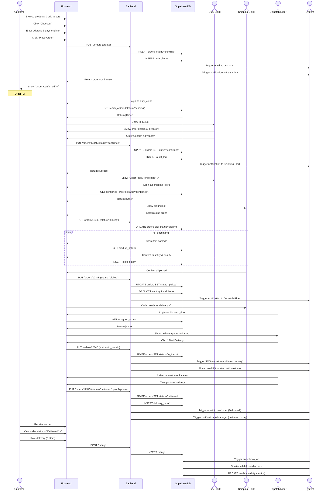
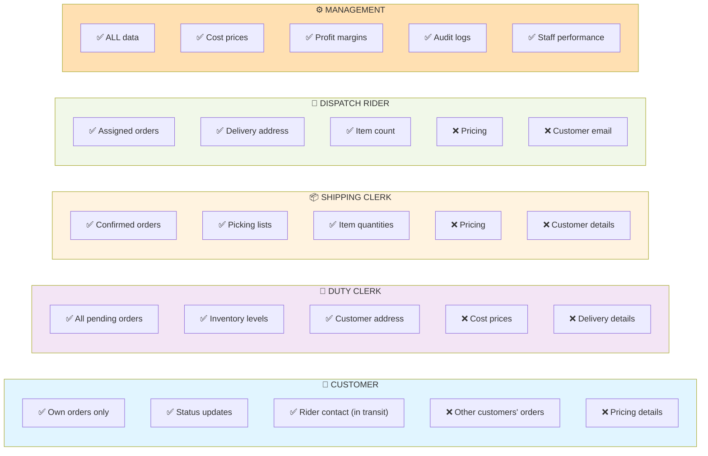

# Smart Cart AI - Security & Access Control Audit Report
## Multi-Role Grocery Delivery System

**Date**: March 25, 2026  
**Audit Type**: Role-Based Access Control (RBAC), Order Lifecycle, Data Visibility  
**System**: React + Supabase Multi-Tenant Grocery Delivery App

---

## Executive Summary

### Current State
The Smart Cart AI application has **basic authentication** but **critical access control gaps**:
- ✅ Only 2 roles implemented: `admin` + `user` (customer)
- ❌ Missing 3 required specialist roles: duty_clerk, shipping_clerk, dispatch_rider
- ❌ Customers cannot track their own orders
- ❌ Orders not linked to authenticated users
- ❌ No order status audit trail
- ❌ No role-based workflow for order processing
- ⚠️ All status updates only for admins

### Risk Level: **🔴 CRITICAL**

The system is not production-ready for multi-role order fulfillment. Security vulnerabilities exist around:
1. Customer order history retrieval (no user_id foreign key)
2. No authorization checks for order visibility
3. No department-based access control
4. No audit trail for compliance

---

## 1. Current RBAC Implementation

### 1.1 Role Definitions

```
┌─────────────────────────────────────────────────────────────┐
│                    CURRENT ROLES                            │
├─────────────────────────────────────────────────────────────┤
│ Role        │ Description        │ Access Level            │
├─────────────┼────────────────────┼─────────────────────────┤
│ "admin"     │ Management         │ Full dashboard access   │
│ "user"      │ Customer           │ Browse & checkout only  │
│ (missing)   │ duty_clerk         │ N/A - NOT IMPLEMENTED  │
│ (missing)   │ shipping_clerk     │ N/A - NOT IMPLEMENTED  │
│ (missing)   │ dispatch_rider     │ N/A - NOT IMPLEMENTED  │
└─────────────────────────────────────────────────────────────┘
```

### 1.2 Role Assignment Flow

```
User Signs Up
    ↓
User selects: "customer" or "admin"
    ↓
Supabase trigger: handle_new_user()
    ↓
    ├─→ account_type = "admin" → role = 'admin'
    └─→ account_type = anything else → role = 'user'
    ↓
Role stored in auth.users metadata
```

**Issue**: Only hardcoded recognition of "admin". All other types collapse to "user".

### 1.3 Authentication Method

- **Provider**: Supabase Auth (email/password)
- **Token**: JWT in localStorage
- **Role Retrieval**: RPC function `has_role(user_id, role_name)`
- **Frontend Check**: `ProtectedRoute` component checks `isAdmin` boolean

---

## 2. Access Control Audit

### 2.1 Frontend Access Control

| Page/Feature | Auth Check | Role Check | Issue |
|---|---|---|---|
| `/dashboard` | ✅ JWT token | ⚠️ "admin" only | No granular permissions |
| `/checkout` | ⚠️ No check | ❌ None | Anyone can place orders |
| `/shop` | ⚠️ No check | ❌ None | Anonymous access allowed |
| Order history | ❌ NOT PROVIDED | ❌ None | 🔴 Customers can't see their orders |
| Category mgmt | ❌ No checks | ⚠️ RLS only | Relies on backend RLS |
| Product mgmt | ❌ No checks | ⚠️ RLS only | Relies on backend RLS |

### 2.2 Supabase RLS Policies

#### Products Table
```sql
-- SELECT: Public (anyone)
-- INSERT/UPDATE: auth.uid() AND has_role(auth.uid(), 'admin')
-- DELETE: admin only
```
✅ Proper read access, ✅ Restricted write

#### Orders Table
```sql
-- SELECT: auth.uid() AND has_role(auth.uid(), 'admin')
-- INSERT: Authenticated users
-- UPDATE: auth.uid() AND has_role(auth.uid(), 'admin')
```
🔴 **CRITICAL**: Customers can SELECT all orders (if authenticated)!  
🔴 **CRITICAL**: Can UPDATE only their own? NO - Admin-only!  
🔴 Customers can't see their own orders by design.

#### Order Items Table
```sql
-- SELECT: Any authenticated user (can see all items)
-- Other: Admin-only
```
❌ **VULNERABILITY**: Customers can read all order_items from all orders

#### Inventory Table
```sql
-- SELECT: Public (anyone)
-- Other: Admin-only
```
✅ Read-only for customers

### 2.3 RLS Policy Gaps

| Problem | Impact | Severity |
|---------|--------|----------|
| No `user_id` in orders table | Can't filter by customer | 🔴 CRITICAL |
| RLS allows any auth user to read all orders | Privacy breach | 🔴 CRITICAL |
| RLS allows any auth user to read all order_items | Privacy breach | 🔴 CRITICAL |
| No row-level filtering by `user_id` | Can't restrict per-customer | 🔴 CRITICAL |
| Order status updates admin-only | No specialist workflows | 🔴 HIGH |
| No audit trail table | Can't track changes | 🔴 HIGH |

---

## 3. Order Lifecycle Analysis

### 3.1 Current Order Flow (BROKEN)

```
Customer → Checkout.tsx
    ↓
Creates order (status = "pending")
    ↓
OrderRepository.createOrder()
    ├─ INSERT orders table
    ├─ INSERT order_items table
    └─ INSERT sales_log table
    ↓
Order created
    ✅ Customer sees confirmation
    ❌ Customer CANNOT see order again
    ↓
Admin Dashboard → OrdersTab
    ↓
Admin MANUALLY changes status:
    ├─ "pending" → "processing" (duty_clerk work)
    ├─ "processing" → "shipped" (shipping_clerk work)
    ├─ "shipped" → "delivered" (dispatch_rider work)
    └─ Any status → "cancelled" (refund)
    ↓
Order complete (without proper hand-off)
```

**Issues**:
- ❌ No role-based state machine
- ❌ No validation of status transitions
- ❌ No tracking of WHO changed status
- ❌ No notifications to other roles
- ❌ Riders don't know when orders are ready
- ❌ Clerks don't know order priority
- ❌ No proof of delivery tracking

### 3.2 Desired Order Lifecycle

```
1. PENDING (Customer → System)
   ├─ Created at checkout
   └─ Date: created_at

2. CONFIRMED (Duty Clerk → Order)
   ├─ Verified inventory
   ├─ Checked payment
   └─ Ready for picking

3. PICKING (Shipping Clerk → Order)
   ├─ Picking from shelves
   ├─ Scanning items
   └─ Progress tracking

4. PICKED (Shipping Clerk → Order)
   ├─ All items gathered
   ├─ Quality check done
   └─ Ready for dispatch

5. IN_TRANSIT (Dispatch Rider → Order)
   ├─ Rider assigned
   ├─ GPS tracking
   └─ ETA shared with customer

6. DELIVERED (Dispatch Rider → Order)
   ├─ Signature or photo proof
   ├─ Customer confirmation
   └─ Transaction complete

7. COMPLETED (System → Order)
   ├─ Payment settled
   ├─ Inventory updated
   └─ Analytics recorded

Or (At any point → CANCELLED)
   ├─ Reason tracked
   ├─ Refund issued
   └─ Inventory restored
```

---

## 4. Data Visibility Matrix

### 4.1 Who Should See What?

```
┌─────────────────────────────────────────────────────────────────┐
│               DATA VISIBILITY BY ROLE                           │
├──────────────────┬──────┬──────┬────────┬────────┬──────────────┤
│ Data             │Cust. │Duty  │ Ship.  │Dispatch│ Mgmt │
│                  │      │Clerk │ Clerk  │ Rider  │      │
├──────────────────┼──────┼──────┼────────┼────────┼──────┤
│ Own Orders       │ ✅   │ -    │ ✅ *   │ ✅ *   │ ✅   │
│ All Orders       │ ❌   │ ✅   │ ✅     │ ❌     │ ✅   │
│ Customer Name    │ ✅   │ ✅   │ ✅     │ ✅     │ ✅   │
│ Customer Email   │ ✅   │ ✅   │ -      │ ✅     │ ✅   │
│ Customer Phone   │ ✅   │ ✅   │ ✅ *   │ ✅ *   │ ✅   │
│ Address          │ ✅   │ ✅   │ ✅     │ ✅     │ ✅   │
│ Item Details     │ ✅   │ ✅   │ ✅     │ ⚠️  *  │ ✅   │
│ Unit Price       │ ✅   │ ✅   │ ✅     │ -      │ ✅   │
│ Rider Name       │ -    │ -    │ -      │ ✅     │ ✅   │
│ Rider Phone      │ ✅ * │ -    │ -      │ -      │ ✅   │
│ Vehicle Info     │ -    │ -    │ -      │ ✅     │ ✅   │
│ Delivery Proof   │ ✅   │ -    │ -      │ ✅     │ ✅   │
│ Cost Price       │ ❌   │ ✅   │ ✅     │ ❌     │ ✅   │
│ Profit/Margin    │ ❌   │ -    │ -      │ ❌     │ ✅   │
│ All Customers    │ ❌   │ ❌   │ ❌     │ ❌     │ ✅   │
└──────────────────┴──────┴──────┴────────┴────────┴──────┘

Legend:
✅ = Can see
❌ = Must NOT see
-  = Not relevant
⚠️ = Limited/Partial
*  = With restrictions (during assignment)
```

---

## 5. Security Vulnerabilities Found

### 🔴 CRITICAL (Implement Immediately)

#### 5.1 Missing user_id in Orders Table
**Location**: Database schema  
**Impact**: Customers cannot retrieve their own orders  
**Current**:
```sql
CREATE TABLE orders (
  id UUID PRIMARY KEY,
  customer_name TEXT,
  customer_email TEXT,
  address TEXT,
  status TEXT,
  ...
  -- Missing: user_id FK to auth.users(id)
)
```

**Fix Required**:
```sql
ALTER TABLE orders 
ADD COLUMN user_id UUID REFERENCES auth.users(id);

UPDATE orders SET user_id = (
  SELECT id FROM auth.users 
  WHERE email = orders.customer_email
  LIMIT 1
);

ALTER TABLE orders ALTER COLUMN user_id SET NOT NULL;
```

#### 5.2 No Row-Level Security Filter by User
**Location**: Supabase RLS policies  
**Issue**: Current policy:
```sql
CREATE POLICY "authenticated_read_orders" ON orders
  FOR SELECT TO authenticated
  USING (true);  -- 🔴 ALLOWS READING ALL ORDERS
```

**Fix**:
```sql
CREATE POLICY "users_read_own_orders" ON orders
  FOR SELECT TO authenticated
  USING (auth.uid() = user_id OR has_role(auth.uid(), 'admin'));
```

#### 5.3 No Ordered Items Privacy Control
**Location**: Supabase RLS on order_items  
**Issue**: Authenticated users can read all order_items from all orders
**Fix**: Add RLS to filter by order.user_id
```sql
CREATE POLICY "read_order_items" ON order_items
  FOR SELECT TO authenticated
  USING (
    order_id IN (
      SELECT id FROM orders 
      WHERE user_id = auth.uid() 
         OR has_role(auth.uid(), 'admin')
    )
  );
```

#### 5.4 No Specialist Roles Implemented
**Location**: Database, frontend, business logic  
**Issue**: Can't enforce department-based workflows  
**Fix**: Add roles enum table and implement RBAC

#### 5.5 Order Status Not Validated
**Location**: OrderRepository.updateOrderStatus()  
**Current**:
```typescript
static async updateOrderStatus(orderId: string, status: string) {
  const { error } = await supabase
    .from("orders")
    .update({ status })
    .eq("id", orderId);  // ❌ No validation
  if (error) throw error;
}
```

**Fix**: Add status validation
```typescript
const VALID_STATUSES = ["pending", "confirmed", "picking", "picked", "in_transit", "delivered", "cancelled"] as const;
if (!VALID_STATUSES.includes(status)) {
  throw new Error(`Invalid status: ${status}`);
}
```

#### 5.6 No Audit Trail for Order Changes
**Location**: Order update processes  
**Issue**: Can't track who changed what and when  
**Fix**: Create audit table
```sql
CREATE TABLE order_audit_log (
  id UUID PRIMARY KEY DEFAULT gen_random_uuid(),
  order_id UUID REFERENCES orders(id),
  changed_by UUID REFERENCES auth.users(id),
  changed_at TIMESTAMPTZ DEFAULT now(),
  previous_status TEXT,
  new_status TEXT,
  change_reason TEXT
);
```

### 🟠 HIGH (Implement Before Production)

#### 5.7 No Order Notifications to Customers
**Issue**: Customers are not notified of order status changes  
**Assign To**: Duty Clerk, Shipping Clerk, Dispatch Rider  
**Fix**: Add notification table and email/SMS triggers

#### 5.8 No Assignment of Orders to Specialists
**Issue**: Dispatch rider doesn't know which orders to deliver  
**Fix**: Create assignments table
```sql
CREATE TABLE role_assignments (
  id UUID PRIMARY KEY,
  order_id UUID REFERENCES orders(id),
  user_id UUID REFERENCES auth.users(id),
  role TEXT, -- 'duty_clerk', 'shipping_clerk', 'dispatch_rider'
  assigned_at TIMESTAMPTZ,
  completed_at TIMESTAMPTZ
);
```

#### 5.9 No Delivery Proof Tracking
**Issue**: Dispatch riders can't submit proof of delivery  
**Fix**: Add delivery_proof table with image/signature storage

#### 5.10 Customer Can't Track Orders
**Issue**: No order tracking UI after checkout  
**Fix**: Create "My Orders" page with real-time status updates

### 🟡 MEDIUM (Best Practices)

#### 5.11 Hardcoded Role Names
**Issue**: Role names as strings throughout code  
**Fix**: Use enums
```typescript
enum UserRole {
  CUSTOMER = 'customer',
  DUTY_CLERK = 'duty_clerk',
  SHIPPING_CLERK = 'shipping_clerk',
  DISPATCH_RIDER = 'dispatch_rider',
  MANAGEMENT = 'management',
}
```

#### 5.12 No Role-Based Routing
**Issue**: All role-specific UIs in single dashboard  
**Fix**: Separate routes per role:
```
/dashboard/customer → Order history, tracking
/dashboard/duty-clerk → Confirm & prepare orders
/dashboard/shipping → Pick & pack orders
/dashboard/dispatch → Assign delivery routes
/dashboard/management → Analytics & reporting
```

#### 5.13 No Permission Hierarchy
**Issue**: Can't define what each role can do  
**Fix**: Create permissions matrix
```typescript
const PERMISSIONS = {
  'duty_clerk': ['read:order', 'update:order_status:confirmed', 'read:inventory'],
  'shipping_clerk': ['read:order', 'update:order_status:picking', 'read:inventory'],
  // etc.
};
```

---

## 6. Recommended RBAC Architecture

### 6.1 Proposed Role Hierarchy

```
                         SYSTEM
                            │
                ┌───────────┬┴────────┬───────────┐
                │           │        │           │
            CUSTOMER    DUTY_CLERK  SHIPPING   DISPATCH_RIDER
                                    CLERK
                │           │        │           │
                └───┬───────┴─┬──────┴────┬──────┘
                    │         │           │
                    └─────────┴─ MANAGEMENT
                              (SuperAdmin)
```

### 6.2 Role Definitions & Responsibilities

```
╔════════════════════════════════════════════════════════════════╗
║                        CUSTOMER                                ║
╠════════════════════════════════════════════════════════════════╣
║ Purpose: Shop and receive groceries                            ║
║ Capabilities:                                                  ║
║  • Browse products                                             ║
║  • Manage cart                                                 ║
║  • Checkout & place orders                                    ║
║  • View own order history & status                            ║
║  • Track delivery in real-time                                ║
║  • Rate delivery experience                                   ║
╚════════════════════════════════════════════════════════════════╝

╔════════════════════════════════════════════════════════════════╗
║                      DUTY CLERK                                ║
╠════════════════════════════════════════════════════════════════╣
║ Purpose: Process and prepare orders for fulfillment            ║
║ Capabilities:                                                  ║
║  • View pending orders (queue)                                ║
║  • Verify payment & inventory availability                    ║
║  • Change status: pending → confirmed                         ║
║  • View inventory levels                                      ║
║  • Flag out-of-stock items                                    ║
║  • Cancel orders (with reason)                                ║
║ Cannot:                                                        ║
║  • Pick products physically                                   ║
║  • Assign deliveries                                          ║
║  • See cost prices or profit margins                          ║
╚════════════════════════════════════════════════════════════════╝

╔════════════════════════════════════════════════════════════════╗
║                   SHIPPING CLERK                               ║
╠════════════════════════════════════════════════════════════════╣
║ Purpose: Pick products and prepare for delivery                ║
║ Capabilities:                                                  ║
║  • View confirmed orders ready for picking                    ║
║  • Update status: confirmed → picking → picked               ║
║  • Scan/mark items as picked                                  ║
║  • Split items between pick waves (if batching)              ║
║  • Report quality issues with items                           ║
║  • View picking queue (priority based)                        ║
║ Cannot:                                                        ║
║  • See pricing/profit information                             ║
║  • Assign riders                                              ║
║  • Deliver orders                                             ║
╚════════════════════════════════════════════════════════════════╝

╔════════════════════════════════════════════════════════════════╗
║                   DISPATCH RIDER                               ║
╠════════════════════════════════════════════════════════════════╣
║ Purpose: Deliver orders to customers                           ║
║ Capabilities:                                                  ║
║  • View assigned orders (by route/zone)                       ║
║  • See customer address & delivery instructions               ║
║  • Update status: picked → in_transit                         ║
║  • Confirm delivery: in_transit → delivered                   ║
║  • Submit delivery proof (photo/signature)                    ║
║  • Collect cash payments (if applicable)                      ║
║  • Share driver contact with customer                         ║
║  • Track GPS location (for dispatch team)                     ║
║ Cannot:                                                        ║
║  • See pricing information                                    ║
║  • Cancel orders                                              ║
║  • Modify order contents                                      ║
╚════════════════════════════════════════════════════════════════╝

╔════════════════════════════════════════════════════════════════╗
║                      MANAGEMENT                                ║
╠════════════════════════════════════════════════════════════════╣
║ Purpose: Oversee all operations and business metrics           ║
║ Capabilities:                                                  ║
║  • View all orders (all statuses)                              ║
║  • View all analytics & KPIs                                   ║
║  • Assign riders to routes                                    ║
║  • Manage inventory & reorder levels                           ║
║  • Manage staff (users, roles, permissions)                   ║
║  • View cost prices & profit margins                          ║
║  • Generate reports                                           ║
║  • Cancel/refund orders                                       ║
║  • System administration                                      ║
╚════════════════════════════════════════════════════════════════╝
```

---

## 7. Order Processing Flow - Mermaid Sequence Diagrams

### 7.1 Complete Order Lifecycle



### 7.2 Data Access at Each Stage

```mermaid
graph TD
    subgraph PENDING["📦 PENDING - Duty Clerk Views"]
        P1["Order ID"]
        P2["Customer Name & Email"]
        P3["Delivery Address"]
        P4["Items List"]
        P5["Total Amount"]
        P6["Inventory Levels"]
        P7["⚠️ NOT: Cost price, Profit margin"]
    end

    subgraph PICKING["🏪 PICKING - Shipping Clerk Views"]
        SH1["Order ID"]
        SH2["Picking List (by shelf location)"]
        SH3["Item Quantities"]
        SH4["Product Images"]
        SH5["Quality Requirements"]
        SH6["⚠️ NOT: Unit price, Customer contact"]
    end

    subgraph IN_TRANSIT["🚗 IN_TRANSIT - Dispatch Rider Views"]
        DR1["Customer Name & Address"]
        DR2["Route Map"]
        DR3["Delivery Instructions"]
        DR4["Customer Phone Number"]
        DR5["Item Count (what car holds)"]
        DR6["⚠️ NOT: Item prices, Customer email"]
    end

    subgraph DELIVERED["✅ DELIVERED - Customer Sees"]
        C1["Order ID & Confirmation"]
        C2["Items Ordered"]
        C3["Total Price Paid"]
        C4["Delivery Date & Time"]
        C5["Rider Name & Rating"]
        C6["Receipt/Invoice"]
        C7["⚠️ NOT: Cost price, Profit, Rider phone<br/>when not yet delivered"]
    end

    PENDING --> PICKING
    PICKING --> IN_TRANSIT
    IN_TRANSIT --> DELIVERED
```



### 7.3 Role-Based Data Visibility



---

## 8. Implementation Roadmap

### Phase 1: Critical Fixes (Week 1-2)
- [ ] Add `user_id` FK to orders table
- [ ] Add `user_id` FK to order_items table
- [ ] Implement row-level RLS filters
- [ ] Validate order statuses with enum
- [ ] Create audit_log table
- [ ] Add created_by/updated_by fields to orders

### Phase 2: Specialist Roles (Week 3-4)
- [ ] Create `user_roles` table with ENUM type
- [ ] Create `role_assignments` table
- [ ] Implement role_based routing (separate dashboards)
- [ ] Create role-specific views/components
- [ ] Implement role-based API endpoints

### Phase 3: Order Workflow (Week 5-6)
- [ ] Implement full state machine validation
- [ ] Create order notifications system
- [ ] Build duty_clerk confirmation workflow
- [ ] Build shipping_clerk picking workflow
- [ ] Build dispatch_rider tracking

### Phase 4: Customer Experience (Week 7-8)
- [ ] Build "My Orders" page for customers
- [ ] Real-time order status tracking
- [ ] Delivery proof display
- [ ] Customer ratings & feedback
- [ ] Email/SMS notifications

### Phase 5: Management Dashboard (Week 9-10)
- [ ] Analytics by order status
- [ ] Staff performance metrics
- [ ] Audit trail viewer
- [ ] Report generation
- [ ] System administration panel

---

## 9. Recommended Database Schema Changes

### Add New Tables

```sql
-- User Roles Enumeration
CREATE TYPE user_role AS ENUM (
  'customer',
  'duty_clerk',
  'shipping_clerk',
  'dispatch_rider',
  'management'
);

-- Order Status Enumeration (NOT TEXT)
CREATE TYPE order_status AS ENUM (
  'pending',
  'confirmed',
  'picking',
  'picked',
  'in_transit',
  'delivered',
  'cancelled'
);

-- Audit Log (Track all changes)
CREATE TABLE IF NOT EXISTS order_audit_log (
  id UUID PRIMARY KEY DEFAULT gen_random_uuid(),
  order_id UUID NOT NULL REFERENCES orders(id),
  changed_by UUID NOT NULL REFERENCES auth.users(id),
  previous_status order_status,
  new_status order_status,
  change_reason TEXT,
  changed_at TIMESTAMPTZ DEFAULT now(),
  created_at TIMESTAMPTZ DEFAULT now()
);

-- Role Assignments (Which role for which order)
CREATE TABLE IF NOT EXISTS order_assignments (
  id UUID PRIMARY KEY DEFAULT gen_random_uuid(),
  order_id UUID NOT NULL REFERENCES orders(id),
  assigned_user_id UUID NOT NULL REFERENCES auth.users(id),
  assigned_role user_role NOT NULL,
  assigned_at TIMESTAMPTZ DEFAULT now(),
  completed_at TIMESTAMPTZ,
  notes TEXT
);

-- Picked Items Tracking
CREATE TABLE IF NOT EXISTS picked_items (
  id UUID PRIMARY KEY DEFAULT gen_random_uuid(),
  order_id UUID NOT NULL REFERENCES orders(id),
  product_id UUID NOT NULL REFERENCES products(id),
  picked_by UUID NOT NULL REFERENCES auth.users(id),
  quantity_picked INT NOT NULL,
  quality_check JSONB,
  picked_at TIMESTAMPTZ DEFAULT now()
);

-- Delivery Proof
CREATE TABLE IF NOT EXISTS delivery_proof (
  id UUID PRIMARY KEY DEFAULT gen_random_uuid(),
  order_id UUID NOT NULL REFERENCES orders(id),
  rider_id UUID NOT NULL REFERENCES auth.users(id),
  proof_type TEXT, -- 'photo' or 'signature'
  proof_url TEXT,
  delivered_at TIMESTAMPTZ DEFAULT now()
);
```

### Alter Existing Tables

```sql
-- Update orders table
ALTER TABLE orders
  ADD COLUMN user_id UUID REFERENCES auth.users(id),
  ADD COLUMN status order_status DEFAULT 'pending',
  ADD COLUMN created_by UUID REFERENCES auth.users(id),
  ADD COLUMN updated_by UUID REFERENCES auth.users(id),
  ADD COLUMN updated_at TIMESTAMPTZ DEFAULT now();

-- Update order_items table  
ALTER TABLE order_items
  ADD COLUMN picked BOOLEAN DEFAULT false,
  ADD COLUMN quality_notes TEXT;
```

---

## 10. Security Checklist

- [ ] Add `user_id` to orders table
- [ ] Implement per-user RLS policies for orders
- [ ] Implement per-user RLS policies for order_items
- [ ] Validate order status with ENUM (not TEXT)
- [ ] Create audit log for all order state changes
- [ ] Implement role-based access control
- [ ] Create role assignment tracking
- [ ] Add delivery proof tracking
- [ ] Implement order notifications
- [ ] Add rate limiting on API endpoints
- [ ] Sign all sensitive API calls with HMAC
- [ ] Encrypt sensitive customer data in transit
- [ ] Implement CORS properly (only frontend domain)
- [ ] Add input validation on all API endpoints
- [ ] Log all administrative actions
- [ ] Implement session timeout (30 min)
- [ ] Add 2FA for admin/management accounts
- [ ] Regular security audits (quarterly)

---

## 11. Summary Table: Current vs. Recommended

| Aspect | Current | Recommended | Priority |
|--------|---------|-------------|----------|
| User Roles | 2 | 5 | 🔴 CRITICAL |
| Order Tracking | ❌ | Customer-visible | 🔴 CRITICAL |
| Status Machine | String-based | ENUM-validated | 🔴 CRITICAL |
| RLS Filtering | Broken | Per-user filtering | 🔴 CRITICAL |
| Audit Trail | ❌ | Full audit log | 🔴 CRITICAL |
| Notifications | ❌ | Email/SMS | 🟠 HIGH |
| Delivery Proof | ❌ | Photo/signature | 🟠 HIGH |
| Role Dashboards | 1 monolithic | 5 specialized | 🟠 HIGH |
| Permissions | Hardcoded | RBAC matrix | 🟡 MEDIUM |

---

## Conclusion

The Smart Cart AI application has functional order processing, but **critical security gaps** prevent it from being a production-ready multi-role system:

### Must Fix Before Launch
1. ✅ Add user-order relationship (user_id FK)
2. ✅ Implement row-level security filters
3. ✅ Create 5 distinct user roles
4. ✅ Build role-based dashboards
5. ✅ Implement order audit trail

### Why This Matters
- **Data Privacy**: Customers must only see their own orders
- **Operational Efficiency**: Each role should see only their work queue
- **Compliance**: Audit trails required for regulatory compliance
- **User Experience**: Customers need order tracking
- **Team Coordination**: Staff need clear responsibilities

**Recommendation**: Implement Phase 1 & 2 immediately. The system cannot go live with current access control.

